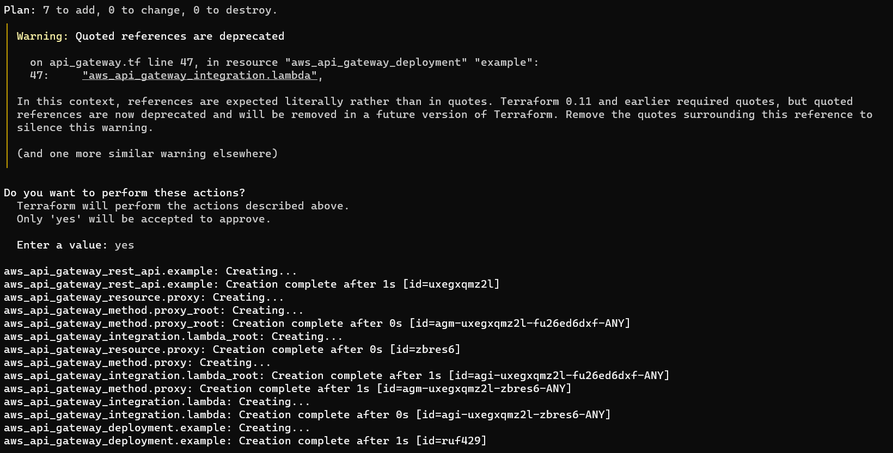
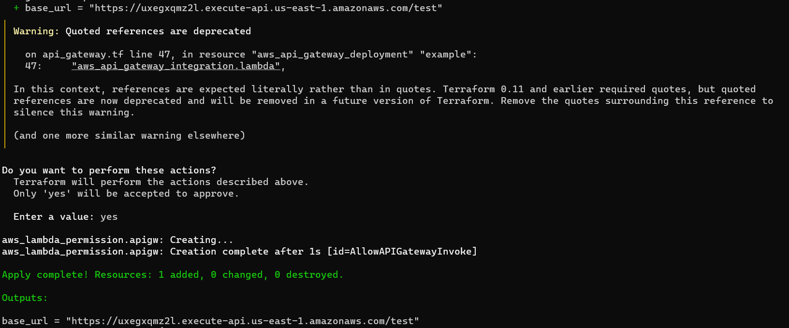
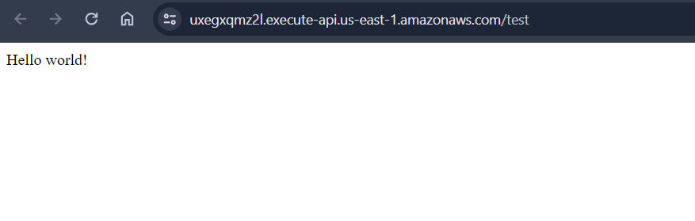

<p align="center">
  <a href="" rel="noopener">
 </a>
</p>

<h1 align="center">Criando um terraform para deploy do API Gateway e uma função Lambda</h1> 
<p align="center"><i></i></p>

## 📑 Requisitos

- Ter AWS CLI instalado e configurado.

- Ter terraform instalado.

Para mais informações, há um repositório com as informações necessárias para instalar e configurar o terraform e o AWS CLI: [Instalando e configurando Terraform](https://github.com/CleitonOS/compass-terraform-desafio1)

## 📝 Tabela de conteúdos
- [Criando arquivo YAML do Deploy da Lambda Function no Editor de Textos (Passo 1)](#step1)
- [Criando a função Lambda (Passo 2)](#step2)
- [Configurando API Gateway (Passo 3)](#step3)
- [Referências](#documentation)

## ⚙️ Construindo o pacote de funções Lambda (Passo 1)<a name = "step1"></a>

- Executaremos essas etapas de construção manualmente e construiremos uma função AWS Lambda muito simples.

1. Começamos criando um novo diretório chamado **pkg-lambda-function**

- Usaremos o JavaScript para o tempo de execução, portanto nosso arquivo vai se chamar **"main.js"**, com o seguinte código-fonte:

    ```yaml
    'use strict';

    exports.handler = function (event, context, callback) {
        var response = {
            statusCode: 200,
            headers: {
                'Content-Type': 'text/html; charset=utf-8',
            },
            body: "<p>Hello world!</p>",
        };
        callback(null, response);
    };
    ```

    - O código acima é a função mais simples possível para uso com o API Gateway, onde retornamos "Hello world!".

- Na linha de comando use um método compatível com seu sistema e CLI para compactar esse arquivo/pasta - "pkg-lambda-function".

## ⚙️ Criando a Função Lambda (Passo 2)<a name = "step2"></a>

1. Para começar, vamos criar um Bucket S3 temporário.

- Com o AWS CLI instalado, execute os seguintes comandos:

  ```
  $ aws s3api create-bucket --bucket=terraform-serverless-example --region=us-east-1
  ```

2. Faça o upload do seu arquivo zipado para este Bucket do S3:

    ```
    $ aws s3 cp pkge-lambda-function.zip s3://terraform-serverless-example/v1.0.0/pkge-lambda-function.zip
    ```

3. Criando a função Lambda

  - **Observação**: um arquivo do terraform (**lambda.tf**) já está criado nesse repositório com todo o código de implantação. Mas caso queira editar da sua forma irei deixar o código logo abaixo.

- CÓDIGO GENÉRICO:

  ```yaml
    provider "aws" {
    region = "us-east-1"
  }

  resource "aws_lambda_function" "example" {
    function_name = "ServerlessExample"

    # The bucket name as created earlier with "aws s3api create-bucket"
    s3_bucket = "terraform-serverless-example"
    s3_key    = "v1.0.0/pkge-lambda-function.zip"

    # "main" is the filename within the zip file (main.js) and "handler"
    # is the name of the property under which the handler function was
    # exported in that file.
    handler = "main.handler"
    runtime = "nodejs8.10"

    role = "${aws_iam_role.lambda_exec.arn}"
  }

  # IAM role which dictates what other AWS services the Lambda function
  # may access.
  resource "aws_iam_role" "lambda_exec" {
    name = "serverless_example_lambda"

    assume_role_policy = <<EOF
  {
    "Version": "2012-10-17",
    "Statement": [
      {
        "Action": "sts:AssumeRole",
        "Principal": {
          "Service": "lambda.amazonaws.com"
        },
        "Effect": "Allow",
        "Sid": ""
      }
    ]
  }
  EOF
  }
  ```

- Caso encontre algum erro ao editar, cheque a documentação de referência no final do READme.

  > Observações:
    - Cada função do Lambda deve ter uma função do IAM associada que determina o acesso que ela terá a outros serviços da AWS.
    - A configuração acima específica uma função sem política de acesso, efetivamente não dando à função acesso a nenhum serviço da AWS, uma vez que nosso aplicativo de exemplo não requer tal acesso.

<br>

4. Inicie o terraform 

- Na linha de comando digite:
  
  ```
  terraform init
  ```

- Aplique a configuração:

  ```
  terraform apply
  ```

- Depois que a função for criada com sucesso, tente invocá-la usando a AWS CLI:

  ```yaml
  $ aws lambda invoke --region=us-east-1 --function-name=ServerlessExample output.txt
  {"StatusCode": 200}
  ```
  ```yaml
  $ cat output.txt
  ```

- Se tudo ocorrer bem, você terá um resultado semelhante á esse:

  ```yaml
  {
    "statusCode":200,
    "headers":{
      "Content-Type":"text/html; charset=utf-8"
    },
    "body":"
  Hello world!"
  }
  ```

## ⚙️ Configurando API Gateway (Passo 3)<a name = "step3"></a>

- Antes de começarmos, é preciso entender que todas as solicitações recebidas pelo API Gateway devem corresponder a um recurso e método configurados para serem tratados.
- Com isso, vamos anexar o seguinte código ao arquivo **lambda.tf** para definir um recurso de proxy:

    ```yaml
    resource "aws_api_gateway_resource" "proxy" {
      rest_api_id = "${aws_api_gateway_rest_api.example.id}"
      parent_id   = "${aws_api_gateway_rest_api.example.root_resource_id}"
      path_part   = "{proxy+}"
    }

    resource "aws_api_gateway_method" "proxy" {
      rest_api_id   = "${aws_api_gateway_rest_api.example.id}"
      resource_id   = "${aws_api_gateway_resource.proxy.id}"
      http_method   = "ANY"
      authorization = "NONE"
    }
    ```

1. Crie um novo arquivo **api_gateway.tf** no mesmo diretório do **lambda.tf**.

- Vamos começar configurando o objetvo raiz "REST API", da seguinte forma:

    ```yaml
    resource "aws_api_gateway_rest_api" "example" {
      name        = "ServerlessExample"
      description = "Terraform Serverless Application Example"
    }
    ```

    - Essa "API Rest" é o contêiner para todos os outros objetos do API Gateway que criaremos, isso quer dizer que o que for criado estará dentro desse escopo.

2. Configurando para que as soliticações desse método sejam enviadas para a função Lambda definida anteriormente:

    ```yaml
    resource "aws_api_gateway_integration" "lambda" {
      rest_api_id = "${aws_api_gateway_rest_api.example.id}"
      resource_id = "${aws_api_gateway_method.proxy.resource_id}"
      http_method = "${aws_api_gateway_method.proxy.http_method}"

      integration_http_method = "POST"
      type                    = "AWS_PROXY"
      uri                     = "${aws_lambda_function.example.invoke_arn}"
    }
    ```

- O **AWS_PROXY** tipo de integração faz com que o gateway de API chame a API de outro serviço da AWS. Neste caso, ele chamará a API do AWS Lambda para criar uma “invocação” da função Lambda.
- Infelizmente, o recurso proxy não pode corresponder a um caminho vazio na raiz da API. Para lidar com isso, uma configuração semelhante deve ser aplicada ao recurso raiz integrado ao objeto REST API:

    ```yaml
    resource "aws_api_gateway_method" "proxy_root" {
     rest_api_id   = "${aws_api_gateway_rest_api.example.id}"
     resource_id   = "${aws_api_gateway_rest_api.example.root_resource_id}"
     http_method   = "ANY"
     authorization = "NONE"
    }

    esource "aws_api_gateway_integration" "lambda_root" {
     rest_api_id = "${aws_api_gateway_rest_api.example.id}"
     resource_id = "${aws_api_gateway_method.proxy_root.resource_id}"
     http_method = "${aws_api_gateway_method.proxy_root.http_method}"

     integration_http_method = "POST"
     type                    = "AWS_PROXY"
     uri                     = "${aws_lambda_function.example.invoke_arn}"
    }
    ```

3. Criando uma "implantação" do API Gateway para ativar a configuração e expor a API em uma URL que pode ser usada para testes:

    ```yaml
    resource "aws_api_gateway_deployment" "example" {
      depends_on = [
        "aws_api_gateway_integration.lambda",
        "aws_api_gateway_integration.lambda_root",
      ]

      rest_api_id = "${aws_api_gateway_rest_api.example.id}"
      stage_name  = "test"
    }
    ```

- Agora na linha de comando execute **terraform apply**, para criar estes objetos. (Certifique-se de estar na pasta dos arquivos criados do terraform)

    

    - Recursos criados com sucesso.

4. Para finalizar precisamos permitir que o API Gateway acesse o Lambda.

- Por padrão, quaisquer dos dois serviços da AWS não têm acesso um ao outro, até que o acesso seja explicitamente concedido. Para funções Lambda, o acesso é concedido por meio do recurso **aws_lambda_permission**, que deve ser adicionado ao **lambda.tf** arquivo criado em etapa anterior:

- Vamos adicionar ao **lambda.tf**, este código:

    ```yaml
    resource "aws_lambda_permission" "apigw" {
      statement_id  = "AllowAPIGatewayInvoke"
      action        = "lambda:InvokeFunction"
      function_name = "${aws_lambda_function.example.function_name}"
      principal     = "apigateway.amazonaws.com"

      # The /*/* portion grants access from any method on any resource
      # within the API Gateway "REST API".
      source_arn = "${aws_api_gateway_rest_api.example.execution_arn}/*/*"
    }
    ```

- Para testar a API criada você precisará acessar sua URL de teste. 
- Para facilitar o acesso, adicione a seguinte saída no **lambda.tf**:

    ```yaml
    output "base_url" {
      value = "${aws_api_gateway_deployment.example.invoke_url}"
    }
    ```

- Aplique as alterações na linha de comando com **terraform apply**

- Esse deve ser o resultado:

    

<br>

- Por fim, acesse a URL que foi retornada pela linha de comando e você verá uma mensagem sendo retornada do código de função do Lambda carregado anteriormente, por meio do endpoint do API Gateway.

    

### Desafio concluído!

## Referências utilizadas:<a name="documentation"></a>

- [Serverless Applications with AWS Lambda and API Gateway](https://registry.terraform.io/providers/hashicorp/aws/2.34.0/docs/guides/serverless-with-aws-lambda-and-api-gateway)

